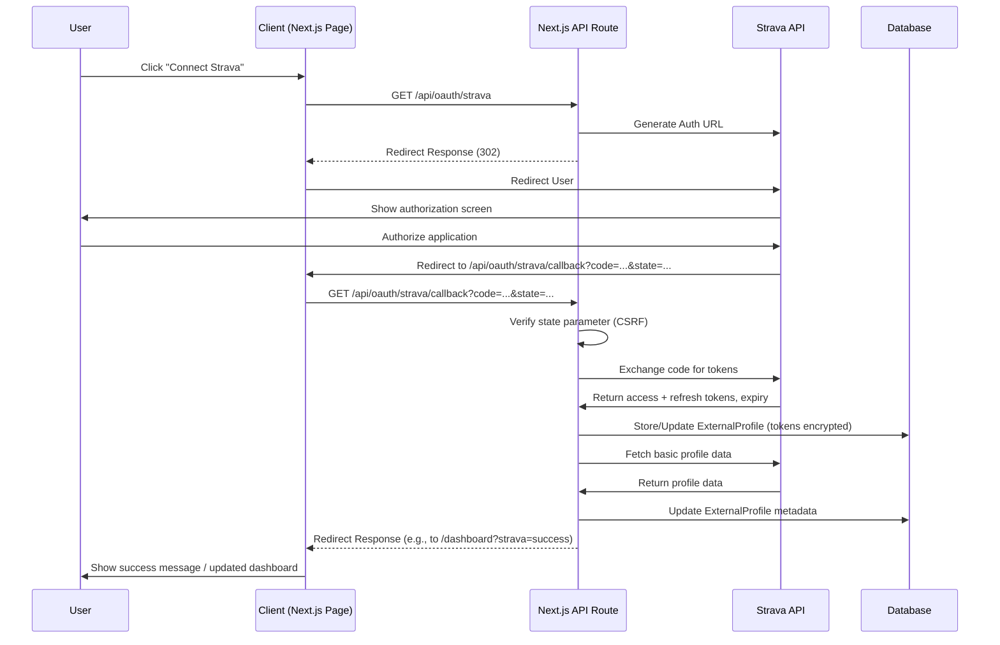

# Werkout.in Technical Implementation Documentation

## 1. System Overview

```yaml
system_name: Werkout.in
system_type: Hyperlocal Fitness Connection Platform
architecture_style: Microservices-Inspired Monolith
primary_goal: Connect fitness seekers with local trainers/groups while integrating with existing platforms
```

This system serves as a connection layer between fitness seekers and providers (trainers, coaches, group leaders) with a hyperlocal focus. Rather than creating a closed ecosystem, the platform integrates with existing social and fitness platforms where users and professionals already maintain a presence.

### 1.1 Core Domain Model

```mermaid
classDiagram
    User <|-- SeekerProfile : links via userId
    User <|-- ProviderProfile : links via userId
    User "1" --> "*" ExternalProfile
    // Simplified diagram focusing on implemented models
    // Removed Service, Event, Group, Connection for now
    
    class User {
        +String _id (MongoDB ObjectId)
        +String clerkId
        +String email
        +String firstName?
        +String lastName?
        +String profileImageUrl?
        +UserType userType?
        +Boolean profileComplete
        +Boolean isActive
        +Location location?
        +Date createdAt
        +Date updatedAt
        // Methods handled by Clerk/API routes
    }
    
    class SeekerProfile {
        +String _id
        +ObjectId userId
        +String[] goals?
        +FitnessLevel fitnessLevel?
        +String preferences?
        +String healthConditions?
        +Date createdAt
        +Date updatedAt
    }
    
    class ProviderProfile {
        +String _id
        +ObjectId userId
        +String bio?
        +String[] specialties?
        +String[] certifications?
        +Number yearsOfExperience?
        +String[] servicesOffered?
        +String availability?
        +ResponseTime responseTime?
        +String websiteUrl?
        +Date createdAt
        +Date updatedAt
    }
    
    class ExternalProfile {
        +String _id
        +ObjectId userId
        +String provider // e.g., strava
        +String providerUserId
        +String accessToken // Encrypted
        +String refreshToken? // Encrypted
        +Date expiresAt?
        +String[] scopes?
        +Object profileData?
        +Date lastSync?
        +Date createdAt
        +Date updatedAt
    }

    class Location { <<DataType>>
      type: "Point"
      coordinates: [Number, Number]
      address?: String
      city?: String
      state?: String
      country?: String
    }
    
    enum UserType {
        Seeker
        Provider
    }
    
    enum FitnessLevel {
        Beginner
        Intermediate
        Advanced
    }

    enum ResponseTime {
        WithinHour
        WithinFewHours
        Within24Hours
        MoreThan24Hours
    }
```

## 2. Technical Requirements

### 2.1 Functional Requirements

```json
{
  "high_priority": [
    {
      "id": "FR-1",
      "name": "User Registration & Onboarding",
      "description": "System must allow users to register via Clerk, select a user type (Seeker/Provider), and complete a basic profile wizard.",
      "acceptance_criteria": [
        "Clerk handles email/password and social sign-up/sign-in.",
        "User must select Seeker or Provider after initial sign-up.",
        "Multi-step wizard collects necessary profile information based on user type.",
        "User record created/updated in DB upon wizard completion.",
        "Clerk metadata (userType, profileComplete) updated."
      ],
      "related_apis": ["/api/profile/set-type", "/api/profile/update"]
    },
    {
      "id": "FR-2",
      "name": "External Platform Integration (Strava)",
      "description": "Users must be able to connect their Strava account.",
      "acceptance_criteria": [
        "OAuth authentication flow for Strava.",
        "Store Strava tokens securely.",
        "Fetch and display basic Strava profile info on dashboard."
      ],
      "related_apis": ["/api/oauth/strava", "/api/oauth/strava/callback"]
    },
    {
      "id": "FR-3",
      "name": "Location-Based Provider Search",
      "description": "Seekers must be able to find Providers based on proximity and basic filters.",
      "acceptance_criteria": [
        "Search based on user-provided location (lat/lng) and radius.",
        "Results are paginated.",
        "Filters for specialties implemented."
        // "Results must be sorted by distance by default" - Implicit via geoNear/geoWithin
      ],
      "related_apis": ["GET /api/search"]
    },
    {
      "id": "FR-4",
      "name": "Provider Profiles (Public & Dashboard)",
      "description": "Publicly viewable provider profiles and a private user dashboard.",
      "acceptance_criteria": [
        "Dashboard displays current user's profile summary.",
        "Dynamic route `/providers/[providerId]` displays public provider info.",
        "Public profile includes bio, specialties, location (city/state), etc."
      ],
      "related_apis": ["GET /api/profile/me", "GET /api/providers/[providerId]"]
    }
  ],
  "medium_priority": [] // Event Management deferred
}
```

### 2.2 Non-Functional Requirements

```json
{
  "performance": {
    "page_load_time": "< 2 seconds for initial load, < 500ms for subsequent interactions",
    "search_response_time": "< 1 second for results within 25 mile radius",
    "api_response_time": "95th percentile < 500ms",
    "concurrent_users": "Support for 5,000 concurrent users in MVP"
  },
  "scalability": {
    "horizontal_scaling": "Vercel handles frontend/API scaling; MongoDB Atlas handles DB scaling.", // Adjusted
    "database_sharding": "MongoDB collections designed with future sharding in mind",
    "growth_projection": "Architecture must support 10x growth without major refactoring"
  },
  "security": {
    "authentication": "Managed via Clerk (handles sign-up, sign-in, session management, MFA)", // Confirmed
    "data_protection": "PII encrypted at rest and in transit; Secure token storage needed for ExternalProfile.", // Adjusted
    "api_security": "Clerk middleware for auth; Rate limiting, CORS protection, input validation needed.", // Adjusted
    "compliance": "GDPR-ready data storage and processing"
  },
  "reliability": {
    "uptime": "99.9% target for MVP",
    "backup": "Hourly database snapshots with 30-day retention",
    "fault_tolerance": "Graceful degradation of non-critical features"
  }
}
```

## 3. Technical Architecture

### 3.1 System Components

```yaml
components:
  client_application:
    type: Next.js React Application (including API Routes)
    deployment: Vercel
    key_features:
      - Server Components & Client Components
      - App Router for routing
      - API Routes for backend logic
      - Tailwind CSS, SWR, React Hook Form, Zod
    critical_path_components:
      - Authentication flows (Clerk integration)
      - Onboarding Wizard
      - Search interface & results
      - Dashboard & Public Profiles
      - External Connection UI (Strava)
  
  # api_server removed - integrated into Next.js app
  
  database:
    type: MongoDB
    deployment: MongoDB Atlas (M10 or equivalent)
    key_features:
      - Mongoose ODM
      - Geospatial indexing
      - Aggregation pipeline
    critical_collections:
      - users
      - providerprofiles
      - seekerprofiles
      - externalprofiles
      # Removed services, events, groups for now
  
  external_integrations:
    platforms:
      - strava:
          auth_method: OAuth 2.0
          data_access: API v3
          status: Implemented (basic connection & sync)
      # Other platforms deferred
```

### 3.2 Data Schema

```json
{
  "users": {
    "collection_name": "users",
    "indexes": [
      { "fields": { "clerkId": 1 }, "options": { "unique": true } },
      { "fields": { "email": 1 }, "options": { "unique": true } },
      { "fields": { "userType": 1 } },
      { "fields": { "location.coordinates": "2dsphere" } }
    ],
    "schema": {
      "_id": "ObjectId",
      "clerkId": { "type": "String", "required": true },
      "email": { "type": "String", "required": true },
      "firstName": { "type": "String" },
      "lastName": { "type": "String" },
      "profileImageUrl": { "type": "String" },
      "userType": { "type": "String", "enum": ["seeker", "provider"] },
      "profileComplete": { "type": "Boolean", "default": false },
      "isActive": { "type": "Boolean", "default": true },
      "location": { // Optional top-level location
        "type": { "type": "String", "enum": ["Point"], "default": "Point" },
        "coordinates": { "type": "[Number]", "required": true }, // [longitude, latitude]
        "address": { "type": "String" },
        "city": { "type": "String" }, // Added for simpler display?
        "state": { "type": "String" }, // Added for simpler display?
        "country": { "type": "String" } // Added for simpler display?
      },
      "createdAt": { "type": "Date", "auto": true },
      "updatedAt": { "type": "Date", "auto": true }
    },
    "relationships": [
      { "collection": "seekerprofiles", "type": "1:1", "field": "userId" },
      { "collection": "providerprofiles", "type": "1:1", "field": "userId" },
      { "collection": "externalprofiles", "type": "1:n", "field": "userId" }
    ]
  },
  
  "providerprofiles": { // Note: collection names are often pluralized by Mongoose
    "collection_name": "providerprofiles",
    "indexes": [
      { "fields": { "userId": 1 }, "options": { "unique": true } },
      { "fields": { "specialties": 1 } }
    ],
    "schema": {
      "_id": "ObjectId",
      "userId": { "type": "ObjectId", "ref": "User", "required": true },
      "bio": { "type": "String", "maxlength": 1000 },
      "specialties": { "type": "[String]", "trim": true },
      "certifications": { "type": "[String]", "trim": true },
      "yearsOfExperience": { "type": "Number", "min": 0 },
      "servicesOffered": { "type": "[String]", "trim": true },
      "availability": { "type": "String" }, // Simple text for now
      "responseTime": { "type": "String", "enum": ["within_hour", "within_few_hours", "within_24_hours", "more_than_24_hours"] },
      "websiteUrl": { "type": "String" },
      "createdAt": { "type": "Date", "auto": true },
      "updatedAt": { "type": "Date", "auto": true }
    }
  },

  "seekerprofiles": {
    "collection_name": "seekerprofiles",
    "indexes": [
      { "fields": { "userId": 1 }, "options": { "unique": true } }
    ],
    "schema": {
        "_id": "ObjectId",
        "userId": { "type": "ObjectId", "ref": "User", "required": true },
        "goals": { "type": "[String]", "trim": true },
        "fitnessLevel": { "type": "String", "enum": ["beginner", "intermediate", "advanced"] },
        "preferences": { "type": "String", "maxlength": 500 },
        "healthConditions": { "type": "String", "maxlength": 1000 },
        "createdAt": { "type": "Date", "auto": true },
        "updatedAt": { "type": "Date", "auto": true }
    }
  },
  
  "externalprofiles": {
    "collection_name": "externalprofiles",
    "indexes": [
      { "fields": { "userId": 1 } }, 
      { "fields": { "provider": 1, "providerUserId": 1 } },
      { "fields": { "userId": 1, "provider": 1 }, "options": { "unique": true } }
    ],
    "schema": {
      "_id": "ObjectId",
      "userId": { "type": "ObjectId", "ref": "User", "required": true },
      "provider": { "type": "String", "required": true }, // e.g., 'strava'
      "providerUserId": { "type": "String", "required": true },
      "accessToken": { "type": "String", "required": true }, // Needs encryption
      "refreshToken": { "type": "String" }, // Needs encryption
      "expiresAt": { "type": "Date" },
      "scopes": { "type": "[String]" },
      "profileData": { "type": "Object" },
      "lastSync": { "type": "Date" },
      "createdAt": { "type": "Date", "auto": true },
      "updatedAt": { "type": "Date", "auto": true }
    },
    "validations": [
      "A user can only connect one account per provider",
      "Access/refresh tokens must be encrypted before storage"
    ]
  }
}
```

### 3.3 API Specification

```yaml
openapi: 3.0.0
info:
  title: Werkout.in API (via Next.js API Routes)
  version: 1.0.0
  description: API for connecting fitness seekers with providers

paths:
  /api/profile/me:
    get:
      summary: Get current user's profile details
      security:
        - clerkAuth: [] # Indicates Clerk middleware handles auth
      responses:
        '200':
          description: Combined user and profile data
        '401':
          description: Unauthorized
        '404':
          description: User profile not found

  /api/profile/update:
    post:
      summary: Create or update user profile (after onboarding wizard)
      security:
        - clerkAuth: []
      requestBody:
        required: true
        content:
          application/json:
            schema: 
              # Define based on expected wizard payload
              type: object
              properties:
                 userType: { type: string, enum: [seeker, provider] }
                 # ... other fields from wizard
      responses:
        '200':
          description: Profile updated successfully
        '400':
          description: Invalid input
        '401':
          description: Unauthorized

  /api/profile/set-type:
    post:
      summary: Set the user type after initial Clerk signup
      security:
        - clerkAuth: []
      requestBody:
        required: true
        content:
          application/json:
            schema:
              type: object
              required: [userType]
              properties:
                userType: { type: string, enum: [seeker, provider] }
      responses:
        '200':
          description: User type set successfully in Clerk metadata
        '400':
          description: Invalid input or user type already set
        '401':
          description: Unauthorized

  /api/search:
    get:
      summary: Search for providers based on location and filters
      parameters:
        - name: lat
          in: query
          required: true
          schema: { type: number }
        - name: lng
          in: query
          required: true
          schema: { type: number }
        - name: radius # in miles
          in: query
          required: true
          schema: { type: number }
        - name: specialties # comma-separated
          in: query
          required: false
          schema: { type: string }
        # - name: providerType # comma-separated - Add if filter implemented
        #   in: query
        #   required: false
        #   schema: { type: string }
        - name: page
          in: query
          required: false
          schema: { type: integer, default: 1 }
        - name: limit
          in: query
          required: false
          schema: { type: integer, default: 10 }
      responses:
        '200':
          description: Search results with pagination
        '400':
          description: Invalid parameters

  /api/providers/{providerId}:
    get:
      summary: Get public profile details for a specific provider
      parameters:
        - name: providerId
          in: path
          required: true
          schema: { type: string } # MongoDB ObjectId
      responses:
        '200':
          description: Provider public profile data
        '404':
          description: Provider not found

  /api/oauth/strava:
    get:
      summary: Initiate Strava OAuth connection flow
      security:
        - clerkAuth: []
      responses:
        '302':
          description: Redirects user to Strava authorization URL

  /api/oauth/strava/callback:
    get:
      summary: Handle OAuth callback from Strava
      # No direct security here, state parameter used for CSRF protection
      parameters:
        - name: code
          in: query
          required: true
          schema: { type: string }
        - name: state
          in: query
          required: true
          schema: { type: string } # For CSRF check
        - name: scope
          in: query
          required: false
          schema: { type: string }
      responses:
        '302':
          description: Redirects user back to dashboard/settings after success/failure
        '400':
          description: Invalid state or code
```

## 4. Integration Architecture

### 4.1 External Platform Integration

```yaml
integration_patterns:
  - pattern_name: OAuth Authentication
    applicable_platforms: [Strava] # Only Strava implemented
    implementation:
      flow_type: Authorization Code
      token_storage: Encrypted in ExternalProfile collection
      refresh_strategy: Implemented (check before API calls / background job TBD)
      error_handling:
        - Rate limit exceeded: Log and potentially notify user
        - Invalid token: Trigger reauthorization flow
    
  # Content Sync and Activity Integration patterns deferred/simplified
```

### 4.2 Component Interfaces

```mermaid
graph TD
    A[Client Application (Next.js)] -->|Clerk Hooks/Components| Clerk[Clerk Frontend]
    A -->|API Route Calls /api/...| A
    A -->|DB Operations via Mongoose| DB[(MongoDB Atlas)]
    A -->|OAuth Redirect/Callback| Strava[Strava API]
    Clerk -->|Auth Checks| ClerkBackend[Clerk Backend]
```
*Simplified diagram showing Next.js app handling UI, API, DB interaction, and OAuth flows, using Clerk for authentication.*

## 5. Implementation Guidelines

### 5.1 Technology Stack Details

```json
{
  "frontend": {
    "framework": "Next.js 15+ (App Router)", // Updated Version
    "language": "TypeScript",
    "state_management": "React Context + SWR",
    "styling": "Tailwind CSS + shadcn/ui", // Added shadcn/ui
    "component_library": "shadcn/ui + Custom components", // Updated
    "form_handling": "React Hook Form + Zod"
  },
  "backend": {
    "framework": "Next.js API Routes", // Confirmed
    "language": "TypeScript",
    "api_style": "RESTful",
    "authentication": "Clerk", // Confirmed
    "validation": "Zod (in API routes/forms)", // Updated
    "logging": "console.log (for now)" // Updated
  },
  "database": {
    "primary": "MongoDB",
    "odm": "Mongoose",
    "indexes": "See schema definitions"
  },
  "external_services": {
    // "file_storage": "AWS S3", // Optional
    // "email": "SendGrid", // Optional
    "maps_geocoding": "node-geocoder (e.g., with OpenStreetMap or other provider)", // Added
    // "monitoring": "Datadog", // Optional
    // "error_tracking": "Sentry" // Optional
  },
  "deployment": {
    "frontend_backend": "Vercel", // Combined
    "database": "MongoDB Atlas",
    "ci_cd": "GitHub Actions" // Optional
  }
}
```

### 5.2 Authentication Flow

*(Diagram and notes already reflect Clerk usage)*

### 5.3 External Platform Integration Flow (Strava)



## 6. Critical Implementation Paths

### 6.1 Location-Based Search

```yaml
feature_name: Location-Based Search
priority: Critical Path
key_components:
  frontend:
    - Geolocation acquisition (with permission)
    - Interactive map component
    - Search form with filters
    - Results display (list and map)
  backend:
    - Geospatial query endpoint
    - Filter processing
    - Result pagination
    - Distance calculation
  data:
    - Provider location as GeoJSON points
    - Geospatial index on location field
    - Compound indexes for filtering

implementation_strategy:
  1. Implement basic location storage in user profiles
  2. Create geospatial index on provider locations
  3. Implement basic proximity search API endpoint
  4. Create frontend search form with location input
  5. Implement results display in list format
  6. Add filter capabilities to search
  7. Implement map view with provider markers
  8. Optimize for performance with pagination and lazy loading

performance_considerations:
  - Limit initial result set size (max 50 per page)
  - Cache frequent searches
  - Use bbox queries for map view to reduce load
  - Implement cursor-based pagination for large result sets

potential_challenges:
  - Users denying location permissions
  - High density areas with many providers
  - Sparse areas with few providers
  - Handling provider specialties search efficiently

fallback_strategies:
  - ZIP/postal code search if geolocation unavailable
  - City/area search as additional option
  - Default search radius adjustment based on density
```

### 6.2 External Content Integration

```yaml
feature_name: External Content Integration
priority: High
key_components:
  frontend:
    - OAuth connection flow
    - Profile content preview
    - Cross-platform content aggregation
  backend:
    - OAuth token management
    - Platform-specific API clients
    - Synchronization jobs
    - Error handling and retry logic
  data:
    - External profile storage
    - Content reference storage
    - Token secure storage

implementation_strategy:
  1. Implement OAuth connection flow for Instagram
  2. Create secure token storage mechanism
  3. Implement basic profile data synchronization
  4. Add content reference synchronization
  5. Create frontend display components for Instagram content
  6. Repeat for additional platforms in priority order
  7. Implement cross-platform content aggregation
  8. Add synchronization monitoring and error handling

security_considerations:
  - Encrypt all OAuth tokens at rest
  - Implement token refresh before expiration
  - Follow principle of least privilege for API access
  - Clear separation between user data and platform data

potential_challenges:
  - API rate limits on external platforms
  - Token expiration and refresh failures
  - Changes to external APIs
  - Content moderation concerns

fallback_strategies:
  - Manual profile URL entry if OAuth fails
  - Graceful UI degradation when content unavailable
  - Clear error messaging for connection issues
  - Asynchronous reconnection attempts
```

## 7. Testing Strategy

```yaml
testing_levels:
  unit_testing:
    framework: Jest
    coverage_target: 80%
    focus_areas:
      - Service functions
      - Utility helpers
      - Data validation
      - Component rendering
    implementation:
      - Test files co-located with implementation
      - Mocking of external dependencies
      - CI integration for every PR
  
  integration_testing:
    framework: Jest + Supertest
    coverage_target: 70%
    focus_areas:
      - API endpoints
      - Database interactions
      - External service mocks
    implementation:
      - Test database with seeded data
      - Automated test suites per service
      - Mock external APIs
  
  end_to_end_testing:
    framework: Cypress
    coverage: Critical user journeys
    focus_areas:
      - User registration and login
      - Search functionality
      - Provider profile viewing
      - External platform connection
    implementation:
      - Staging environment tests
      - Visual regression testing
      - Mobile responsive testing
  
  performance_testing:
    framework: k6
    focus_areas:
      - Search API response times
      - Concurrent user simulation
      - Database query performance
    thresholds:
      - Search API p95 < 1s
      - 300 requests/second minimum

testing_environments:
  development:
    database: Local MongoDB
    external_services: Mocked
  
  testing:
    database: Test MongoDB instance
    external_services: Test accounts/sandboxes
  
  staging:
    database: Staging MongoDB cluster
    external_services: Test accounts/sandboxes
  
  production:
    database: Production MongoDB cluster
    external_services: Production accounts
```

## 8. Deployment and DevOps

```yaml
deployment_pipeline:
  environments:
    - name: development
      trigger: On demand
      auto_deploy: No
      url_pattern: dev-{branch-name}.werkout.in
    
    - name: staging
      trigger: On merge to staging branch
      auto_deploy: Yes
      url_pattern: staging.werkout.in
    
    - name: production
      trigger: On merge to main branch
      approval: Required
      auto_deploy: After approval
      url_pattern: werkout.in

ci_cd_flow:
  1. Code push to repository
  2. Automated tests run
  3. Build process creates artifacts
  4. Static code analysis
  5. Vulnerability scanning
  6. Deployment to target environment
  7. Smoke tests post-deployment
  8. Monitoring alert verification

infrastructure_as_code:
  repository: GitHub
  configuration: Terraform
  secrets_management: AWS Secrets Manager
  environment_variables: Environment-specific .env files

monitoring_and_alerting:
  application_metrics:
    - Response time by endpoint
    - Error rates
    - User registrations/logins
    - Search volume
  
  system_metrics:
    - CPU/Memory utilization
    - Database query performance
    - Network traffic
    - Disk usage
  
  alerts:
    - Error rate > 5% (immediate)
    - API latency p95 > 2s (warning)
    - Failed deployments (immediate)
    - Database connection issues (immediate)
```

## 9. Data Security and Privacy

```yaml
data_classification:
  public:
    - Provider public profiles
    - Public events and groups
    - Publicly shared success stories
  
  private:
    - User contact information
    - Private messages
    - Connection history
  
  sensitive:
    - Authentication credentials
    - OAuth tokens
    - Payment information (future)

security_controls:
  authentication:
    - JWT with short expiration (15 minutes)
    - Refresh token rotation
    - Multi-factor authentication (phase 2)
  
  authorization:
    - Role-based access control
    - Resource ownership validation
    - API scope limitations
  
  data_protection:
    - TLS for all communications
    - Encryption at rest for sensitive data
    - HTTPS enforcement
    - Secure headers implementation
  
  api_security:
    - Rate limiting
    - Input validation
    - CORS configuration
    - Security headers

privacy_implementation:
  user_consent:
    - Clear consent flows for data collection
    - Granular privacy settings
    - Data sharing opt-in requirements
  
  data_minimization:
    - Collect only necessary information
    - Implementation of retention policies
    - Anonymization where possible
  
  user_rights:
    - Data export functionality
    - Account deletion workflow
    - Privacy settings management
```