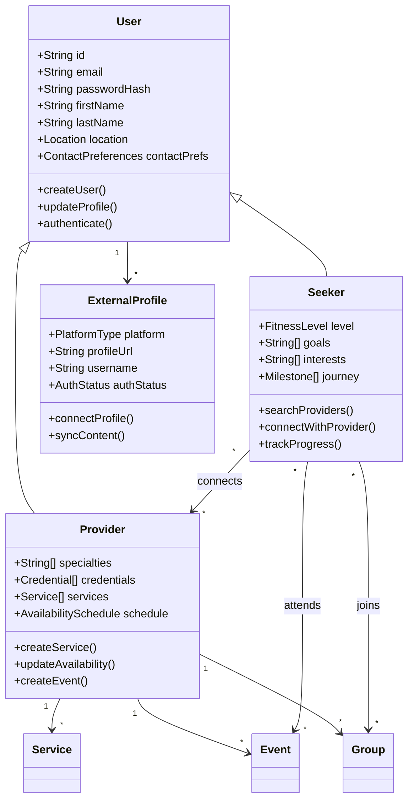
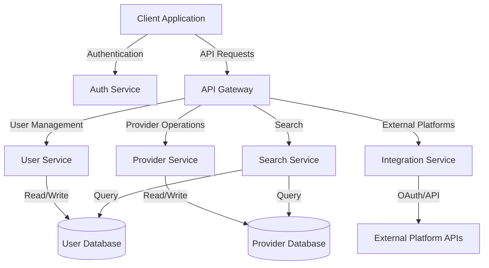
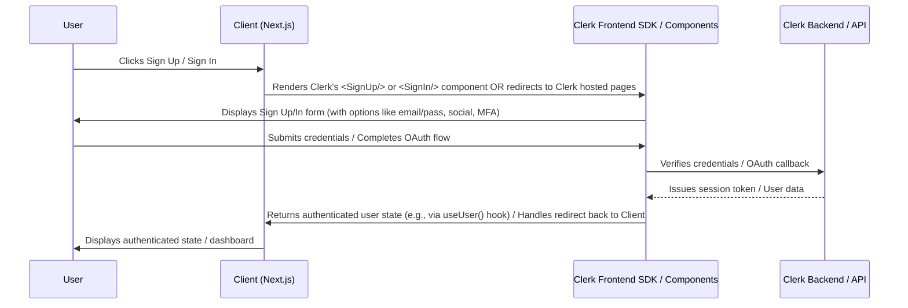
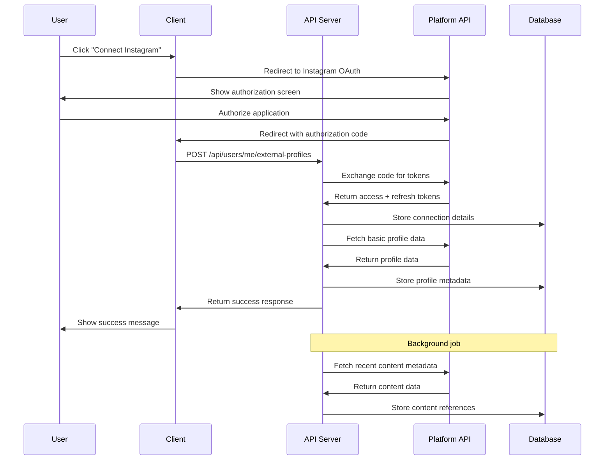

# Werkout.in Technical Implementation Documentation

## 1. System Overview

```yaml
system_name: Werkout.in
system_type: Hyperlocal Fitness Connection Platform
architecture_style: Microservices-Inspired Monolith
primary_goal: Connect fitness seekers with local trainers/groups while integrating with existing platforms
```

This system serves as a connection layer between fitness seekers and providers (trainers, coaches, group leaders) with a hyperlocal focus. Rather than creating a closed ecosystem, the platform integrates with existing social and fitness platforms where users and professionals already maintain a presence.

### 1.1 Core Domain Model



## 2. Technical Requirements

### 2.1 Functional Requirements

```json
{
  "high_priority": [
    {
      "id": "FR-1",
      "name": "User Registration",
      "description": "System must allow users to register as either Seekers or Providers",
      "acceptance_criteria": [
        "Email verification is required",
        "Password must meet complexity requirements",
        "Basic profile information must be collected"
      ],
      "related_apis": ["POST /api/auth/register"]
    },
    {
      "id": "FR-2",
      "name": "External Platform Integration",
      "description": "Users must be able to connect their profiles from external platforms",
      "platforms": ["Instagram", "TikTok", "Strava", "YouTube"],
      "acceptance_criteria": [
        "OAuth authentication where available",
        "Profile content preview within the platform",
        "Periodic synchronization of public content"
      ],
      "related_apis": ["POST /api/users/me/external-profiles"]
    },
    {
      "id": "FR-3",
      "name": "Location-Based Search",
      "description": "Seekers must be able to find Providers based on proximity and filters",
      "acceptance_criteria": [
        "Results must be sorted by distance by default",
        "Maximum search radius configurable up to 50 miles",
        "Filters must include specialties, availability, and provider type"
      ],
      "related_apis": ["GET /api/search"]
    },
    {
      "id": "FR-4",
      "name": "Provider Profiles",
      "description": "Providers must have detailed profiles showcasing their services and credentials",
      "acceptance_criteria": [
        "Contact methods prominently displayed",
        "External content embedded or linked",
        "Services and availability clearly listed"
      ],
      "related_apis": ["GET /api/providers/:id"]
    }
  ],
  "medium_priority": [
    {
      "id": "FR-5",
      "name": "Event Management",
      "description": "Providers must be able to create and manage events",
      "acceptance_criteria": [
        "Location-based discovery of events",
        "Calendar integration options",
        "Attendee management"
      ],
      "related_apis": ["POST /api/events", "GET /api/events"]
    }
  ]
}
```

### 2.2 Non-Functional Requirements

```json
{
  "performance": {
    "page_load_time": "< 2 seconds for initial load, < 500ms for subsequent interactions",
    "search_response_time": "< 1 second for results within 25 mile radius",
    "api_response_time": "95th percentile < 500ms",
    "concurrent_users": "Support for 5,000 concurrent users in MVP"
  },
  "scalability": {
    "horizontal_scaling": "All components must support horizontal scaling",
    "database_sharding": "MongoDB collections designed with future sharding in mind",
    "growth_projection": "Architecture must support 10x growth without major refactoring"
  },
  "security": {
    "authentication": "Managed via Clerk (handles sign-up, sign-in, session management, MFA)",
    "data_protection": "PII encrypted at rest and in transit",
    "api_security": "Rate limiting, CORS protection, input validation",
    "compliance": "GDPR-ready data storage and processing"
  },
  "reliability": {
    "uptime": "99.9% target for MVP",
    "backup": "Hourly database snapshots with 30-day retention",
    "fault_tolerance": "Graceful degradation of non-critical features"
  }
}
```

## 3. Technical Architecture

### 3.1 System Components

```yaml
components:
  client_application:
    type: Next.js React Application
    deployment: Vercel
    key_features:
      - Server-side rendering for SEO and initial load performance
      - Client-side routing for seamless transitions
      - Static generation for content-heavy pages
      - Responsive design using Tailwind CSS
      - Progressive enhancement for core functionality
    critical_path_components:
      - Authentication flows
      - Search interface
      - Provider profiles
      - External content embedding
  
  api_server:
    type: Node.js Express Application
    deployment: AWS Elastic Beanstalk
    key_features:
      - RESTful API design
      - JWT authentication
      - Middleware for validation and authorization
      - Structured error handling
      - Request logging and monitoring
    critical_path_services:
      - Authentication service
      - User service
      - Search service
      - Provider service
      - External integration service
  
  database:
    type: MongoDB
    deployment: MongoDB Atlas (M10 or equivalent)
    key_features:
      - Geospatial indexing for location queries
      - Compound indexes for common query patterns
      - Time-series collections for analytics
      - Aggregation pipeline for complex queries
    critical_collections:
      - users
      - provider_profiles
      - seeker_profiles
      - services
      - events
      - external_profiles
  
  external_integrations:
    platforms:
      - instagram:
          auth_method: OAuth
          data_access: Basic Display API
          content_types: [Images, Videos, Profile]
      - strava:
          auth_method: OAuth 2.0
          data_access: API v3
          content_types: [Activities, Routes, Profile]
      - tiktok:
          auth_method: OAuth
          data_access: Content API
          content_types: [Videos, Profile]
```

### 3.2 Data Schema

```json
{
  "users": {
    "collection_name": "users",
    "indexes": [
      { "fields": { "email": 1 }, "options": { "unique": true } },
      { "fields": { "userType": 1 } },
      { "fields": { "location.coordinates": "2dsphere" } }
    ],
    "schema": {
      "id": "ObjectId",
      "email": { "type": "String", "validation": "email format", "required": true },
      "passwordHash": { "type": "String", "required": true },
      "firstName": { "type": "String", "required": true },
      "lastName": { "type": "String", "required": true },
      "userType": { "type": "String", "enum": ["seeker", "provider"], "required": true },
      "location": {
        "city": { "type": "String", "required": true },
        "state": { "type": "String", "required": true },
        "country": { "type": "String", "required": true },
        "coordinates": {
          "type": { "type": "String", "enum": ["Point"], "required": true },
          "coordinates": { "type": "[Number]", "required": true }
        }
      },
      "contactPreferences": {
        "whatsapp": { "type": "Boolean", "default": false },
        "email": { "type": "Boolean", "default": true },
        "phone": { "type": "Boolean", "default": false }
      },
      "isVerified": { "type": "Boolean", "default": false },
      "isActive": { "type": "Boolean", "default": true },
      "createdAt": { "type": "Date", "default": "currentDate" },
      "updatedAt": { "type": "Date", "default": "currentDate" }
    },
    "validations": [
      "Email must be unique",
      "Passwords must be hashed before storage",
      "Location coordinates must be valid GeoJSON point"
    ],
    "relationships": [
      { "collection": "seeker_profiles", "type": "1:1", "field": "userId" },
      { "collection": "provider_profiles", "type": "1:1", "field": "userId" },
      { "collection": "external_profiles", "type": "1:n", "field": "userId" }
    ]
  },
  
  "provider_profiles": {
    "collection_name": "provider_profiles",
    "indexes": [
      { "fields": { "userId": 1 }, "options": { "unique": true } },
      { "fields": { "specialties": 1 } },
      { "fields": { "verificationStatus": 1 } }
    ],
    "schema": {
      "id": "ObjectId",
      "userId": { "type": "ObjectId", "ref": "users", "required": true },
      "bio": { "type": "String", "required": true },
      "specialties": { "type": "[String]", "required": true },
      "experience": { "type": "Number" },
      "credentials": [{
        "title": { "type": "String", "required": true },
        "organization": { "type": "String", "required": true },
        "year": { "type": "Number" },
        "isVerified": { "type": "Boolean", "default": false }
      }],
      "services": [{
        "title": { "type": "String", "required": true },
        "description": { "type": "String", "required": true },
        "type": { "type": "String", "enum": ["one-on-one", "group", "online", "other"] },
        "isActive": { "type": "Boolean", "default": true }
      }],
      "languages": { "type": "[String]" },
      "responseTime": { "type": "String" },
      "providerType": { "type": "String", "enum": ["trainer", "coach", "group_leader", "gym", "studio"] },
      "verificationStatus": { "type": "String", "enum": ["pending", "verified", "rejected"], "default": "pending" },
      "createdAt": { "type": "Date", "default": "currentDate" },
      "updatedAt": { "type": "Date", "default": "currentDate" }
    }
  },
  
  "external_profiles": {
    "collection_name": "external_profiles",
    "indexes": [
      { "fields": { "userId": 1, "platform": 1 }, "options": { "unique": true } }
    ],
    "schema": {
      "id": "ObjectId",
      "userId": { "type": "ObjectId", "ref": "users", "required": true },
      "platform": { "type": "String", "enum": ["instagram", "tiktok", "strava", "youtube"], "required": true },
      "username": { "type": "String", "required": true },
      "profileUrl": { "type": "String", "required": true },
      "accessToken": { "type": "String" },
      "refreshToken": { "type": "String" },
      "tokenExpiry": { "type": "Date" },
      "lastSyncedAt": { "type": "Date" },
      "isActive": { "type": "Boolean", "default": true },
      "metadata": { "type": "Object" },
      "createdAt": { "type": "Date", "default": "currentDate" },
      "updatedAt": { "type": "Date", "default": "currentDate" }
    },
    "validations": [
      "A user can only connect one account per platform",
      "Access tokens must be encrypted at rest",
      "Expired tokens must trigger a refresh workflow"
    ]
  }
}
```

### 3.3 API Specification

```yaml
openapi: 3.0.0
info:
  title: Werkout.in API
  version: 1.0.0
  description: API for connecting fitness seekers with providers

paths:
  /api/auth/register:
    post:
      summary: Register a new user
      requestBody:
        required: true
        content:
          application/json:
            schema:
              type: object
              required:
                - email
                - password
                - firstName
                - lastName
                - userType
              properties:
                email:
                  type: string
                  format: email
                password:
                  type: string
                  minLength: 8
                firstName:
                  type: string
                lastName:
                  type: string
                userType:
                  type: string
                  enum: [seeker, provider]
      responses:
        '201':
          description: User created successfully
        '400':
          description: Invalid input
        '409':
          description: Email already exists
      performance:
        expected_latency: < 500ms
        rate_limit: 10 requests per minute per IP
      security_considerations:
        - Password must be hashed before storage
        - Email verification flow must be triggered
        - IP-based rate limiting to prevent abuse

  /api/users/me/external-profiles:
    post:
      summary: Connect an external platform profile
      security:
        - bearerAuth: []
      requestBody:
        required: true
        content:
          application/json:
            schema:
              type: object
              required:
                - platform
                - code
              properties:
                platform:
                  type: string
                  enum: [instagram, tiktok, strava, youtube]
                code:
                  type: string
                  description: OAuth authorization code
      responses:
        '201':
          description: External profile connected successfully
        '400':
          description: Invalid input
        '401':
          description: Unauthorized
        '409':
          description: Profile already connected
      implementation_notes:
        - Handles OAuth token exchange flow
        - Stores access and refresh tokens securely
        - Fetches and caches basic profile information
        - Initiates background job for content synchronization

  /api/search:
    get:
      summary: Search for providers based on location and filters
      parameters:
        - name: lat
          in: query
          required: true
          schema:
            type: number
        - name: lng
          in: query
          required: true
          schema:
            type: number
        - name: radius
          in: query
          required: false
          schema:
            type: number
            default: 10
        - name: specialties
          in: query
          required: false
          schema:
            type: array
            items:
              type: string
        - name: providerType
          in: query
          required: false
          schema:
            type: array
            items:
              type: string
      responses:
        '200':
          description: Search results
          content:
            application/json:
              schema:
                type: object
                properties:
                  results:
                    type: array
                    items:
                      type: object
                  pagination:
                    type: object
      performance:
        expected_latency: < 1s for typical radius
        optimization: Geospatial index on provider location
      implementation_notes:
        - Uses MongoDB geospatial queries for proximity search
        - Applies post-query filtering for additional criteria
        - Returns paginated results with distance calculation
        - Includes basic provider information to minimize payload size
```

## 4. Integration Architecture

### 4.1 External Platform Integration

```yaml
integration_patterns:
  - pattern_name: OAuth Authentication
    applicable_platforms: [Instagram, Strava, TikTok, YouTube]
    implementation:
      flow_type: Authorization Code
      token_storage: Encrypted in database
      refresh_strategy: Background worker before expiration
      error_handling:
        - Rate limit exceeded: Exponential backoff
        - Invalid token: Trigger reauthorization
        - Service unavailable: Graceful degradation
    
  - pattern_name: Content Synchronization
    applicable_platforms: [Instagram, TikTok, YouTube]
    implementation:
      sync_frequency: Once per 24 hours per platform
      sync_strategy: Incremental updates only
      content_storage:
        metadata: MongoDB
        content_references: MongoDB with links to original
        media_caching: None (direct embedding from source)
    
  - pattern_name: Activity Integration
    applicable_platforms: [Strava]
    implementation:
      webhook_subscription: For real-time updates
      data_processing: Extract relevant fitness metrics
      privacy_controls: Honor platform and user privacy settings
```

### 4.2 Component Interfaces



## 5. Implementation Guidelines

### 5.1 Technology Stack Details

```json
{
  "frontend": {
    "framework": "Next.js 13+",
    "language": "TypeScript",
    "state_management": "React Context + SWR",
    "styling": "Tailwind CSS",
    "component_library": "Custom components with Headless UI",
    "form_handling": "React Hook Form + Zod"
  },
  "backend": {
    "framework": "Express.js",
    "language": "TypeScript",
    "api_style": "RESTful",
    "authentication": "JWT with refresh tokens",
    "validation": "Joi",
    "logging": "Winston + Morgan"
  },
  "database": {
    "primary": "MongoDB",
    "odm": "Mongoose",
    "indexes": "See schema definitions"
  },
  "external_services": {
    "file_storage": "AWS S3",
    "email": "SendGrid",
    "maps": "Google Maps API",
    "monitoring": "Datadog",
    "error_tracking": "Sentry"
  },
  "deployment": {
    "frontend": "Vercel",
    "backend": "AWS Elastic Beanstalk",
    "database": "MongoDB Atlas",
    "ci_cd": "GitHub Actions"
  }
}
```

### 5.2 Authentication Flow



**Implementation Notes:**

*   The Client application integrates Clerk's React SDK (`@clerk/nextjs`).
*   UI components like `<SignUp/>`, `<SignIn/>`, `<UserButton/>`, and hooks like `useUser()`, `useAuth()` handle most of the frontend flow.
*   Session management, token handling, security features (MFA, password policies), and email verification are managed by Clerk.
*   Backend API routes can be protected using Clerk's middleware or helper functions to verify incoming requests.
*   User profile data beyond basic authentication details (e.g., seeker/provider specific fields) will be stored in the application's database (MongoDB) and potentially linked via Clerk user IDs or stored in Clerk's user metadata.

### 5.3 External Platform Integration Flow



## 6. Critical Implementation Paths

### 6.1 Location-Based Search

```yaml
feature_name: Location-Based Search
priority: Critical Path
key_components:
  frontend:
    - Geolocation acquisition (with permission)
    - Interactive map component
    - Search form with filters
    - Results display (list and map)
  backend:
    - Geospatial query endpoint
    - Filter processing
    - Result pagination
    - Distance calculation
  data:
    - Provider location as GeoJSON points
    - Geospatial index on location field
    - Compound indexes for filtering

implementation_strategy:
  1. Implement basic location storage in user profiles
  2. Create geospatial index on provider locations
  3. Implement basic proximity search API endpoint
  4. Create frontend search form with location input
  5. Implement results display in list format
  6. Add filter capabilities to search
  7. Implement map view with provider markers
  8. Optimize for performance with pagination and lazy loading

performance_considerations:
  - Limit initial result set size (max 50 per page)
  - Cache frequent searches
  - Use bbox queries for map view to reduce load
  - Implement cursor-based pagination for large result sets

potential_challenges:
  - Users denying location permissions
  - High density areas with many providers
  - Sparse areas with few providers
  - Handling provider specialties search efficiently

fallback_strategies:
  - ZIP/postal code search if geolocation unavailable
  - City/area search as additional option
  - Default search radius adjustment based on density
```

### 6.2 External Content Integration

```yaml
feature_name: External Content Integration
priority: High
key_components:
  frontend:
    - OAuth connection flow
    - Profile content preview
    - Cross-platform content aggregation
  backend:
    - OAuth token management
    - Platform-specific API clients
    - Synchronization jobs
    - Error handling and retry logic
  data:
    - External profile storage
    - Content reference storage
    - Token secure storage

implementation_strategy:
  1. Implement OAuth connection flow for Instagram
  2. Create secure token storage mechanism
  3. Implement basic profile data synchronization
  4. Add content reference synchronization
  5. Create frontend display components for Instagram content
  6. Repeat for additional platforms in priority order
  7. Implement cross-platform content aggregation
  8. Add synchronization monitoring and error handling

security_considerations:
  - Encrypt all OAuth tokens at rest
  - Implement token refresh before expiration
  - Follow principle of least privilege for API access
  - Clear separation between user data and platform data

potential_challenges:
  - API rate limits on external platforms
  - Token expiration and refresh failures
  - Changes to external APIs
  - Content moderation concerns

fallback_strategies:
  - Manual profile URL entry if OAuth fails
  - Graceful UI degradation when content unavailable
  - Clear error messaging for connection issues
  - Asynchronous reconnection attempts
```

## 7. Testing Strategy

```yaml
testing_levels:
  unit_testing:
    framework: Jest
    coverage_target: 80%
    focus_areas:
      - Service functions
      - Utility helpers
      - Data validation
      - Component rendering
    implementation:
      - Test files co-located with implementation
      - Mocking of external dependencies
      - CI integration for every PR
  
  integration_testing:
    framework: Jest + Supertest
    coverage_target: 70%
    focus_areas:
      - API endpoints
      - Database interactions
      - External service mocks
    implementation:
      - Test database with seeded data
      - Automated test suites per service
      - Mock external APIs
  
  end_to_end_testing:
    framework: Cypress
    coverage: Critical user journeys
    focus_areas:
      - User registration and login
      - Search functionality
      - Provider profile viewing
      - External platform connection
    implementation:
      - Staging environment tests
      - Visual regression testing
      - Mobile responsive testing
  
  performance_testing:
    framework: k6
    focus_areas:
      - Search API response times
      - Concurrent user simulation
      - Database query performance
    thresholds:
      - Search API p95 < 1s
      - 300 requests/second minimum

testing_environments:
  development:
    database: Local MongoDB
    external_services: Mocked
  
  testing:
    database: Test MongoDB instance
    external_services: Test accounts/sandboxes
  
  staging:
    database: Staging MongoDB cluster
    external_services: Test accounts/sandboxes
  
  production:
    database: Production MongoDB cluster
    external_services: Production accounts
```

## 8. Deployment and DevOps

```yaml
deployment_pipeline:
  environments:
    - name: development
      trigger: On demand
      auto_deploy: No
      url_pattern: dev-{branch-name}.werkout.in
    
    - name: staging
      trigger: On merge to staging branch
      auto_deploy: Yes
      url_pattern: staging.werkout.in
    
    - name: production
      trigger: On merge to main branch
      approval: Required
      auto_deploy: After approval
      url_pattern: werkout.in

ci_cd_flow:
  1. Code push to repository
  2. Automated tests run
  3. Build process creates artifacts
  4. Static code analysis
  5. Vulnerability scanning
  6. Deployment to target environment
  7. Smoke tests post-deployment
  8. Monitoring alert verification

infrastructure_as_code:
  repository: GitHub
  configuration: Terraform
  secrets_management: AWS Secrets Manager
  environment_variables: Environment-specific .env files

monitoring_and_alerting:
  application_metrics:
    - Response time by endpoint
    - Error rates
    - User registrations/logins
    - Search volume
  
  system_metrics:
    - CPU/Memory utilization
    - Database query performance
    - Network traffic
    - Disk usage
  
  alerts:
    - Error rate > 5% (immediate)
    - API latency p95 > 2s (warning)
    - Failed deployments (immediate)
    - Database connection issues (immediate)
```

## 9. Data Security and Privacy

```yaml
data_classification:
  public:
    - Provider public profiles
    - Public events and groups
    - Publicly shared success stories
  
  private:
    - User contact information
    - Private messages
    - Connection history
  
  sensitive:
    - Authentication credentials
    - OAuth tokens
    - Payment information (future)

security_controls:
  authentication:
    - JWT with short expiration (15 minutes)
    - Refresh token rotation
    - Multi-factor authentication (phase 2)
  
  authorization:
    - Role-based access control
    - Resource ownership validation
    - API scope limitations
  
  data_protection:
    - TLS for all communications
    - Encryption at rest for sensitive data
    - HTTPS enforcement
    - Secure headers implementation
  
  api_security:
    - Rate limiting
    - Input validation
    - CORS configuration
    - Security headers

privacy_implementation:
  user_consent:
    - Clear consent flows for data collection
    - Granular privacy settings
    - Data sharing opt-in requirements
  
  data_minimization:
    - Collect only necessary information
    - Implementation of retention policies
    - Anonymization where possible
  
  user_rights:
    - Data export functionality
    - Account deletion workflow
    - Privacy settings management
```